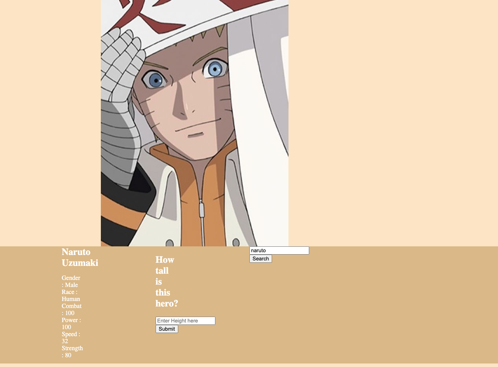

## SuperHeroes

# Product Requirements Documentation

**Summary**

| Field | Detail |
|--------|-----|
| Project Name | SuperHeroes|
| Description | Allows users to learn and test their knowledge on their favorite Superheroes.|
| Developers | Jonathan Pierre |
| Live Website | https://jpierre23.github.io/SuperHeroes/ |
| Repo | https://github.com/JPierre23/SuperHeroes |

## Technologies Used
-HTML5
-CSS3
-JavaScript
-JQuery
-Superhero API

## Problem Being Solved and Target Market
Superhero and comic loving audience that believe they know more than anyone else about their favorite hero. This website offers them a way to test that ability.

## User Stories
- Users should be able to access the site
- Users should be prompted to first search for a hero
- Users should be able to find information on their heroes
- Users should be able to answer question about Hero
- User should be able to search for another Hero

## Screenshots

## Future Enhancements
- More questions to test useers
- Better layout design
- Users will also be able to select for a Random hero to be chosen
- Mobile Friendly
